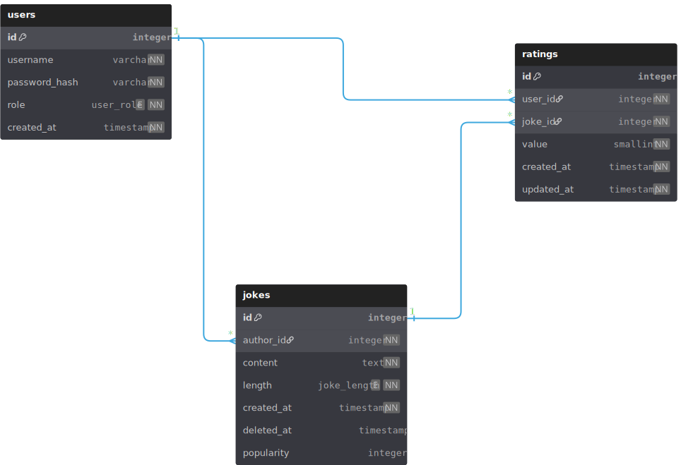

# Rendszerterv

## 1. A rendszer célja

A rendszer célja, hogy interaktívabb vicc oldalt hozzon létre amit a felhasználók bővíthetnek, illetve ezeket értékelni tudják. Mivel egy viccportálról beszélünk a felülete egyszerű lesz. A portált webes felületen el lehet érni telefonról és számítógépről egyaránt. Az ismétlődés illetve a régi viccek elkerülése érdekében az adminok törölhetnek vicceket. Régi vicceket nem tilos küldeni csak nem ajánlott csak azzal megtölteni az oldalt.

## 2. Üzleti folyamatok modellje


## 3. Követelmények

### Funkcionális követlemények:

  * Felhasználók adatainak tárolása
  * Müködjön mobilokon illetve gépen is a weboldal
  * A beküldöt viccek megjelenjenek az oldalon

### Nem funkcionális követelmények:

  * A felhasználók ne jussanak hozzá mások bejeletkezési adatihoz.

### Törvényi előírások, szabványok:
  * W3C ajánlások használata
  * WCAG 2.1 AA használata
  * az OWASP irányelvek betartása

## 4. Funkcionális terv

### Rendszerszereplők:
  * Admin
  * Felhasználó

### Rendszerhasználati esetek és lefutásaik:
  * Admin:
    * Beléphet felhasználóként hogy megnéze az jól müködik-e
    * Látja a felhasználók adatait
    * Vicceket törölhet , de akár felhasználót is
    * Hibákat tudd javitani ha esetleg van

  * Felhasználó:
    * Regisztrálni tudd majd ezekkel az adatokkal bejeletkezni
    * Képes vicceket posztolni és ezeket törölni
    * Más vicceket tudd értékelni

### Menü-hierarchiák:
  * Bejelentkezés:
    * Bejelentkezés
    * Regisztráció
  * Főoldal:
    * Vicc posztolás
    * Kijelentkezés

## 5. Fizikai környezet

A megoldás webes platformra készül, mobil-first megközelítéssel és reszponzív kialakítással, így okostelefonon, táblagépen és PC-n is egyaránt használható böngészőből. A backend Node.js környezetben fut, Railway felhőalapú hosztingon konténerizált vagy menedzselt szolgáltatásként, PostgreSQL adatbázissal.
A hosztolás biztosítja a verziózott környezeteket és az automatikus deploy-t. A kliens oldali réteg HTML, CSS és egyszerű JavaScript alapon készül, reszponzív felülettel és azonnali visszajelzésekkel, a hozzáférhetőségre (WCAG 2.1 AA) és W3C ajánlásokra tekintettel. A fejlesztői eszköztár: Node.js (Express), PostgreSQL (SQL kliens/ORM), Railway projekt és DB, Git verziókezelés, valamint böngésző fejlesztői eszközök. A jelszavak hash-elve tárolódnak és a munkamenet session vagy token alapon működik, OWASP irányelvek követésével.

## 6. Absztrakt domain modell

A fő entitások: Felhasználó, Vicc, Értékelés, valamint szerepkörök User/Admin; a kapcsolatok a publikálás és értékelés folyamatait fedik le. A Felhasználó entitás egyedi felhasználónévvel és hash-elt jelszóval rendelkezik, és pontosan egy szerepkörrel (user vagy admin). Csak hitelesített felhasználó hozhat létre viccet vagy adhat értékelést. A Vicc entitást egy felhasználó hozza létre, tartalmazza a szöveget, időbélyeget és megjelenítéshez szükséges metaadatokat. Törlését admin végezheti moderálási szabályok alapján vagy a létrehozó. Az Értékelés entitás egy felhasználó és egy vicc között 1:1 kardinalitású (egy felhasználó egy adott viccet egyszer értékel, de módosíthatja), és a népszerűség a like-ok mínusz dislike-ok aggregációjával számítható.


## 7. Architekturális terv




### Backend (Node.js + Express):

* REST API végpontok a regisztrációhoz, bejelentkezéshez, viccek kezeléséhez és értékeléshez, az API JSON formátumban kommunikál a kliensekkel.

* Adatkezelés PostgreSQL-ben, az alkalmazás szerepkör alapú hozzáférés-ellenőrzést végez minden védett végpont előtt (user/admin).

* Hitelesítés: bejelentkezéskor session vagy token alapú munkamenet jön létre, a jelszavak biztonságosan, hash-elve tárolódnak, minden admin funkcióhoz külön jogosultság-ellenőrzés tartozik.

* Biztonság: OWASP ajánlások szerinti bevált gyakorlatok, naplózás és hibakezelés részletes hibaüzenetekkel a kliens felé (érzékeny adatok nélkül).

### Adatbázis szerver (PostgreSQL):

* Normalizált sémák a felhasználók, viccek és értékelések tárolására; indexek a listázási és rendezési lekérdezésekhez idő és népszerűség szerint.

* Tranzakciók és egyedi kulcsok garantálják, hogy egy felhasználó egy viccet csak egyszer értékelhet, de az értékelés módosítható.

### Web kliens (HTML, CSS, JS):

* Mobil-first, reszponzív felület kezdőoldali vicclistával, bejelentkezés/regisztráció nézettel, vicc beküldő űrlappal és rendezésválasztóval, dinamikus frissítés oldalújratöltés nélkül.

* Hozzáférés az API-hoz hitelesítés után session vagy token továbbításával; az azonnali visszajelzések biztosítják a felhasználói élményt (siker, hiba, törlés megerősítés).

### Üzemeltetés (Railway):

* Konténerizált Node.js szolgáltatás és menedzselt PostgreSQL, környezeti változókban tárolt titkok, automatikus build/deploy pipeline, mentési és helyreállítási eljárások dokumentálása.

* Szabványok és megfelelés: W3C és WCAG 2.1 AA a frontendnél, privacy by design, security by design, licenc- és jogkezelés, közösségi irányelvek és incidenskezelés.

### Példa REST API feladatleírás a szerepek és adatáramlás illusztrálására:

* POST /api/auth/register: felhasználónév, jelszó; egyediség-ellenőrzés, hash-elés, alap user szerepkör. 
* POST /api/auth/login: token vagy session létrehozása; hibakezelés sikertelen belépésnél.
* GET /api/jokes: minden látogatónak elérhető lista; alapértelmezett rendezés: legújabb elöl; váltható népszerűség szerint.
* POST /api/jokes: csak bejelentkezve; validáció: nem üres, minimális hossz; azonnali publikálás.
* POST/PUT /api/jokes/:id/rate: like/dislike beállítása vagy módosítása; aggregált számlálók frissítése.
* DELETE /api/jokes/:id: csak admin; törlés előtti megerősítés és jogosultság-ellenőrzés.


## 8. Adatbázis terv

### Fő táblák és kapcsolatok:

* users
  * id (PK), username (unique), password_hash, role ENUM(‘user’, ‘admin’), created_at.
  * Index: unique(username), idx_users_role; megjegyzés: a jelszavak hash-elve tárolódnak.

* jokes
  * id (PK), author_id (FK → users.id), content TEXT, created_at, deleted_at NULLABLE.
  * Index: idx_jokes_created_at (listázás idő szerint), idx_jokes_author_id, opcionálisan extra népszerűség oszlop cache-eléshez.

* ratings
  * id (PK), user_id (FK → users.id), joke_id (FK → jokes.id), value SMALLINT (-1 vagy 1), created_at, updated_at.
  * Egyedi kulcs: unique(user_id, joke_id) biztosítja, hogy egy felhasználó egy viccet csak egyszer értékeljen, érték módosítható update-tel.


### Számított népszerűség:

Népszerűség definíció: like-ok száma mínusz dislike-ok száma, lekérdezésben SUM(value) AS popularity a ratings táblán, csoportosítva joke_id szerint. Egyéb emotikonok nem számítanak bele a népszerűség számításába.

Rendezés: ORDER BY popularity DESC vagy created_at DESC a kliens választása alapján, megfelelő indexeléssel és/vagy nézetekkel támogatva.

### Integritási és biztonsági szabályok:
* ON DELETE CASCADE a ratings.user_id és ratings.joke_id kapcsolatokra, hogy törléskor a kapcsolódó értékelések is konzisztensen eltűnjenek.
* Jogosultság-ellenőrzés minden író műveletnél (vicc létrehozás, értékelés, törlés), admin-only a törlés.
* Adatvédelem és megfelelés: minimalizált személyes adatkezelés, átlátható sütikezelés, licenc- és felelősségi szabályok a felhasználói tartalomhoz, bejelentési-eltávolítási folyamat dokumentálása.

### Megjegyzés a teljesítményhez és bővíthetőséghez:
* A listázás és rendezés optimalizálására indexeket kell használni a népszerűség aggregátumhoz, időzített frissítéssel, alternatívaként íráskor fenntartott számlálók is alkalmazhatók tranzakciós védelemmel.
* A kliens oldali élményhez a dinamikus frissítés minimalizálja az újratöltést, a hozzáférhetőség és szabványkövetés a W3C és WCAG 2.1 AA elvek mentén történik.

### DBML
```
Table users {
id integer [pk, increment]
username varchar [unique, not null]
password_hash varchar [not null]
role user_role [not null, default: 'user']
created_at timestamp [not null]
}

Table jokes {
id integer [pk, increment]
author_id integer [not null]
content text [not null]
length joke_length [not null]
created_at timestamp [not null]
deleted_at timestamp
popularity integer [default: 0, note: 'Cached popularity score']
}

Table ratings {
id integer [pk, increment]
user_id integer [not null]
joke_id integer [not null]
value smallint [not null, note: ' -1 or 1']
created_at timestamp [not null]
updated_at timestamp [not null]
}

// Kapcsolatok
Ref: jokes.author_id > users.id
Ref: ratings.user_id > users.id
Ref: ratings.joke_id > jokes.id

// Enum a felhasználói szerepkörökhöz
Enum user_role {
user
admin
}

// Enum a vicc hosszához
Enum joke_length {
short
medium
long
}

// Indexek és megkötések
// A 'ratings' táblában egyedi kulcs, hogy egy felhasználó egy viccet csak egyszer értékelhessen
// Index { user_id, joke_id } [unique]
```



## 9. Implementációs terv

### Web

A webes felület főként HTML, CSS és Javascript nyelven készül. A kódot úgy szervezzük, hogy a HTML, CSS és Javascript fájlok külön-külön legyenek, és egymáshoz csatolva szolgálják ki az oldalak logikáját és megjelenését. Ez biztosítja a jobb átláthatóságot, a könnyebb karbantarthatóságot és a jövőbeni bővítést.

A frontend képes lesz a backend REST API metódusait használni: alkalmazás Javascript fetch hívásokkal kommunikál a Node.js szerverrel, így tudja lekérdezni a posztokat, létrehozni új vicceket, kezelni a like/dislike gombokat, valamint a felhasználói regisztrációt és bejelentkezést.

### Backend

A backend a Node.js környezetben futó Express szerver lesz, amely REST API-kat biztosít a frontend számára. A szerver feladata az adatbázis kezelése, a felhasználók hitelesítése, a posztok létrehozása és módosítása, valamint az adminisztrációs jogosultságok kezelése. A jelszavakat bcrypt könyvtárral titkosítjuk, a felhasználói munkameneteket pedig express-session segítségével kezeljük.

### Adatbázis

Az adatbázis PostgreSQL lesz, ahol két fő tábla található: 'users' a felhasználói adatokhoz és 'posts' a viccekhez. A backend ezen keresztül kommunikál az adatok beszúrására, lekérdezésére és frissítésére.

### Integráció és működés

A felhasználó böngészője a frontend HTML oldalakat tölti be, a JavaScript fetch hívások segítségével küldi el a kéréseket a backend REST API-nak. A backend feldolgozza a kéréseket, végrehajtja az adatbázis műveleteket, majd JSON formátumban visszaküldi az eredményt. A frontend ezt feldolgozza, és frissíti a DOM-ot, így a felhasználó valós időben látja a posztok és értékelések változásait.

## 10. Tesztterv

A tesztelés célja annak biztosítása, hogy az alkalmazás minden funkciója a specifikációnak megfelelően működjön, a felhasználói élmény stabil és biztonságos legyen, valamint a backend és az adatbázis helyesen kommunikáljon.

A tesztelés során ellenőrízzük:

* A felhasználói interakciókat (regisztráció, bejelentkezés, poszt létrehozás, like/dislike)
* Az adminisztrátori funkciókat
* A frontend-backend kommunikációt (fetch API hívások)
* Az adatbázis műveleteket
* A biztonsági és hozzáférési szabályokat (jelszó titkosítás, jogosultságok)
* A reszponzív megjelenést különböző képernyőméreteken.

### Tesztelés típusa

* Funkcionális teszt: ellenőrízzük, hogy minden funkció megfelelően működik a felhasználói és admin felületen.
* Integrációs teszt: a frontend és backend közötti adatátvitel, API hívások helyessége
* Adatbázis teszt: a táblákon végrehajtott műveletek helyessége (INSERT, SELECT, UPDATE, DELETE)
* Biztonsági teszt: jelszó titkosítás, jogosultságok.
* UI teszt: az oldal mobilon és desktopon is használható és jól olvasható.
* Hiba- és kivételkezelési teszt: hibás login, üres mező, nem létező poszt törlése, stb.

### Tesztelési folyamat

#### Regisztráció és bejelentkezés

* Pozitív teszt:
  * Új felhasználó regisztrálása érvényes adatokkal.
  * Bejelentkezés a regisztrált felhasználóval
* Negatív teszt:
  * Üres mezők, már létező felhasználónév, hibás jelszó
* Várható eredmény:
  * Sikeres regisztráció/bejelentkezés -> átirányítás index.html-re
  * Hibás adatok -> felhasználó értesítése, backend nem menti el az adatot

#### Poszt létrehozása és lekérése

* Tesztelés:
  * Belépett felhasználó új viccet posztol
  * Poszt megjelenik a főoldalon
  * Poszt rendezése: legújabb/legnépszerűbb
* Várható eredmény:
  * Poszt helyesen jelenik meg, időbélyeg és szerző látható
  * Rendezés a like/dislike értékek vagy timestamp szerint működik

#### Poszt értékelése

* Tesztelés:
  * Felhasználó értékeli a posztokat
  * Ellenőrizzük a backend és adatbázis értékek frissülését
* Várható eredmény:
  * Like/dislike számláló valós időben frissül

#### Admin funkciók

* Tesztelés:
  * Admin felhasználó töröl egy posztot
* Várható eredmény:
  * Admin törlése sikeres

#### Biztonsági teszt

* Jelszavak az adatbázisban hash-elve tárolódnak
* Session kezelés ellenőrzése (bejárható oldalak, kijelentkezés)
* Hozzáférés ellenőrzése admin funkciókhoz

#### UI és reszponzivitás

* Böngésző ablak átméretezése, mobil eszközön tesztelés.
* Minden oldal és funkció használható legyen kisebb képernyőn is.

#### Hiba- és kivételkezelés

* Üres mezők, rossz adatbevitel, hibás poszt ID, offline állapot tesztelése.
* Backend helyesen küldjön státuszkódokat és hibaüzeneteket.

## 11. Telepítési terv

A szoftver webes felületéhez csak egy ajánlott böngésző telepítése szükséges (Google Chrome, Firefox, Opera, Safari), külön szoftver nem kell hozzá. A webszerverre közvetlenül az internetről kapcsolódnak rá a kliensek.

## 12. Karbantartási terv

A karbantartás célja, hogy az alkalmazás stabil, biztonságos és naprakész maradjon a használat során, valamint biztosítsa a gyors hibajavítást és a további fejlesztések lehetőségét.

### Karbantartás típusai

1. Corrective Maintenance: A felhasználók vagy tesztelők által jelzett hibák javítása.
2. Adaptive Maintenance: A rendszer frissítése a környezet változásai miatt.
3. Perfective Maintenance: Új funkciók hozzáadása, teljesítmény és megbízhatóság javítása.
4. Preventive Maintenance: Olyan problémák elhárítása, amelyek még nem kritikusak, de később problémát okozhatnak.

### Karbantartási folyamat

1. Hiba vagy igény észlelése: felhasználói jelentés, tesztelés vagy fejlesztői megfigyelés
2. Elemzés és osztályozás: hibajavítás, környezeti frissítés vagy funkcióbővítés szükséges-e.
3. Módosítás: a hibát, frissítést vagy új funkciót implementáljuk a megfelelő modulba
4. Tesztelés: az érintett funkciók újratesztelése unit és integrációs tesztekkel.
5. Deployment: a frissített alkalmazás telepítése
6. Dokumentálás: minden változást dokumentálni kell, verziókövetéssel és commit üzenetekkel.
